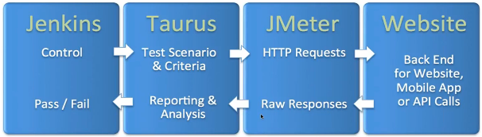
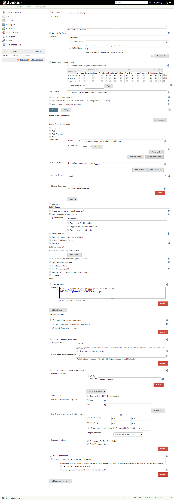

# Jenkins + Taurus + Jmeter



* [JMeter](#jmeter)
* [Jenkins](#jenkins)
* [Blazemeter](#blazemeter)


## JMeter

### Run Test on Your Workstation

* Clone Github project, hydranorth-load-testing(https://github.com/ualbertalib/hydranorth-load-testing)
* [Download](http://jmeter.apache.org/download_jmeter.cgi) and install [Apache JMeter](http://jmeter.apache.org/)
* Start JMeter and open [hn-test-plan-taurus.jmx](./plan/hn-test-plan.jmx)
* Right click on HydraNorth Load Testing Plan then select Merge menu item and open [hn-test-workbench.jmx](./plan/hn-test-workbench.jmx) for Test Script Recorder(HTTP Proxy Server).
* Run the HydraNorth Load Testing test plan. 

### Setup Test Script Recorder

* Right click on HydraNorth Load Testing Plan then select Merge menu item and open [hn-test-workbench.jmx](./plan/hn-test-workbench.jmx) for Test Script Recorder(HTTP Proxy Server).
* [HTTP(S) Test Script Recorder (was: HTTP Proxy Server )](http://jmeter.apache.org/usermanual/component_reference.html)

## Taurus

* Github project: [https://github.com/Blazemeter/taurus](https://github.com/Blazemeter/taurus)
* [Documentation](https://github.com/Blazemeter/taurus/blob/master/docs/Home.md) 

## Jenkins

### Configuration

* Jenkins CI Server: [http://cardiff.library.ualberta.ca/](http://cardiff.library.ualberta.ca/)
* GitHub project: [https://github.com/ualbertalib/hydranorth-load-testing/](https://github.com/ualbertalib/hydranorth-load-testing/)
* JDK: Java 8
* Source Code Management
  * Git
    * Repository URL: https://github.com/ualbertalib/hydranorth-load-testing
  * Additional Behaviours: Clean before checkout
* Build Triggers

   [x] Build after other projects are built
    * Projects to watch: HydraNorth
    
       [x] Trigger only if build is stable
* Build Environment
  * [x] Delete workspace before build starts
* Build 
  * Execute shell
    * Command:
    
       ```bash
       # jmeter jvm options, working with jdk8 without ssl options
       export JVM_ARGS="-Xms512m -Xmx1024m"
       bzt ./apache-jmeter/plan/hn-taurus-config.yml
       ```
* Post-build Actions
  * Aggregate downstream test results
  
     [x] Automatically aggregate all downstream tests
     [x] Include failed builds in results
  * Publish JUnit test result report
     * Test report XMLs: junit.xml
  * Publish Performance test result report
    * Performance report
      * JMeter
         
         Report files: **/hn-test-plan-data.jtl          

* Screen Shot



## Blazemeter

* URL: [https://blazemeter.com/](https://blazemeter.com/)
* Create an account
* Copy API Key: Profile > Personal > API Key
* Set API Key in hn-taurus-config.yml: modules > blazemeter > token

### View Test Results

* Jenkins > hydranorth-load-testing > Build History > Build #XX > Console Output
* Search for: "Online report link" and click on the link


    
